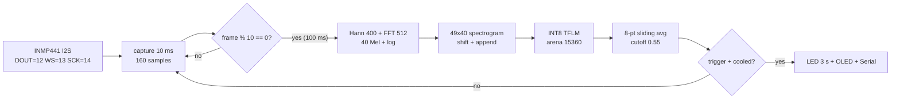

# Begum The Voice — Offline ESP8266 Keyword Spotter


100% offline keyword spotter for **"Begum" (bay-gum)** on ESP8266 + INMP441 + 0.96" SSD1306 OLED.
No cloud. No WiFi. No Ethernet. No UDP / WebSockets / MQTT.

## Contents

- [How it looks](#how-it-looks)
- [Signal chain](#signal-chain)
- [Wiring](#wiring)
- [Repo map](#repo-map)
- [Training](#training)
- [Evaluation](#evaluation)
- [Firmware build and flash](#firmware-build-and-flash)
- [Serial testing](#serial-testing)
- [Performance budgets](#performance-budgets)

## How it looks

Four OLED states, one LED rule (GPIO2, active LOW, ON for 3 s on detection):

```text
+------------------+      +------------------+      +------------------+
| BEGUM            |      | ! KEYWORD !      |      | BEGUM            |
| Listening...     | ---> | BEGUM            | ---> | Cooldown: 3s     |
| say: bay-gum  [_]|      | DETECTED!        |      | please wait...   |
+------------------+      | conf: 87%        |      +------------------+
  idle                    +------------------+        3 s lockout
                           LED ON + Serial log
```

Full pixel mockups: [docs/oled-states.md](docs/oled-states.md).
Full wiring art: [docs/wiring.md](docs/wiring.md).

## Signal chain



Timing (duty-cycle that keeps idle CPU near 8-9%):

```text
 10 ms   10 ms   10 ms  ...  10 ms  | 100 ms window
 |-------|-------|-------|---|------|------------------
 capture capture capture     capture  tick() ~18 ms
                                       avg + threshold
```

Details: [docs/architecture.md](docs/architecture.md).

## Wiring

```text
 ESP8266 D1 mini                INMP441 I2S mic
 -----------------              ----------------
 3V3  ------------------------  VDD
 GND  ------------------------  GND + L/R (L/R to GND)
 D6/GPIO12 <------------------  DOUT (SD)
 D7/GPIO13 ------------------>  LRCLK (WS)
 D5/GPIO14 ------------------>  BCLK (SCK)

 ESP8266                        SSD1306 OLED 128x64 (0x3C)
 -----------------              --------------------------
 3V3  ------------------------  VCC
 GND  ------------------------  GND
 D1/GPIO5 --------------------  SCL
 D2/GPIO4 --------------------  SDA

 LED: GPIO2 built-in, active LOW. Fallback mic: MAX9814 OUT -> A0
 (enable USE_ANALOG_MIC in firmware/src/config.h).
```

## Repo map

```text
begum-the-voice/
  training/   requirements, generate_data, train_model, export_tflite
  firmware/   platformio.ini + src (ino, config, audio, kws, oled, model_data)
  evaluation/ test_accuracy (TPR/FAPH), test_memory (size/RAM/offline)
  docs/       architecture, wiring, oled-states, serial-testing, performance
```

## Training

```bash
cd training
pip install -r requirements.txt
python generate_data.py --out_dir ./data        # full: 5000/lang x 6
python generate_data.py --out_dir ./data --quick # smoke: 20/lang
python train_model.py --data_dir ./data --out_dir ./artifacts
python export_tflite.py --artifacts ./artifacts --data_dir ./data
```

`export_tflite.py` overwrites `firmware/src/model_data.h` and fails if over 50 KB.

## Evaluation

```bash
cd evaluation
python test_accuracy.py --data_dir ../training/data --artifacts ../training/artifacts
python test_memory.py --artifacts ../training/artifacts --firmware ../firmware
```

Targets: TPR over 95%, under 1 false trigger per 24 h, model under 50 KB,
arena exactly 15360 bytes, RAM under 256 KB, zero network symbols.

## Firmware build and flash

```bash
cd firmware
pio run
pio run -t upload
pio device monitor -b 115200
```

Build flags `-Os -g0`, 80 MHz, page-buffer OLED, `delay(1)` every loop.

## Serial testing

Boot (115200 8N1):

```text
=== BEGUM OFFLINE VOICE ACTIVATOR ===
Free Heap: XXXXX bytes
Model Size: XX KB
Tensor Arena: 15360 bytes
OLED: Initialized
Audio: Initialized
KWS: Ready
Listening...
```

Detection:

```text
[12345] BEGUM DETECTED! Confidence: 0.8712
[12346] LED ON, OLED Updated
[15346] Cooldown: 3s
[15346] Ready.
```

Rate proof every 10 s (duty-cycle near 10 Hz):

```text
[20000] infer_rate=10.02 Hz frames=1023 infers=102 last_prob=0.0412 heap=41232
```

Full transcripts: [docs/serial-testing.md](docs/serial-testing.md).

## Performance budgets

| Metric   | Bound                       | Enforced in                    |
|----------|-----------------------------|--------------------------------|
| RAM      | Under 256 KB, arena = 15360 | config.h, kws_inference.h      |
| CPU idle | Under 10%                   | 10 ms capture, 100 ms tick     |
| Model    | Under 50 KB INT8            | export_tflite.py (ValueError)  |
| Latency  | GPIO/OLED under 50 ms       | immediate write + OLED update  |
| FAPH     | Under 1 per 24 h, TPR > 95% | test_accuracy.py               |

Verified numbers: [docs/performance.md](docs/performance.md).
