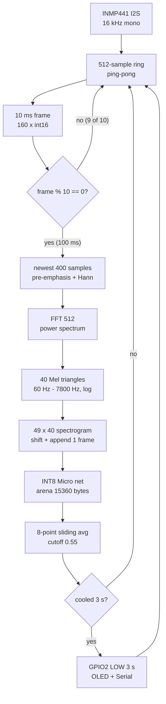

# Architecture

End-to-end view of the offline keyword path: mic to LED in under 50 ms.

## Signal chain



## Duty-cycle timing

Capture runs every 10 ms. The heavy `tick()` runs every 10th frame.

```text
 ms:  0    10    20    30    40    50    60    70    80    90   100
      |-----|-----|-----|-----|-----|-----|-----|-----|-----|-----|
      cap   cap   cap   cap   cap   cap   cap   cap   cap   cap
      ~10ms ~10ms ~10ms ~10ms ~10ms ~10ms ~10ms ~10ms ~10ms ~10ms + tick ~18 ms
                                                                    avg + compare

 100 ms window: ~28 ms busy over 100 ms = ~18% peak during tick frames,
 plus delay(1) every loop brings the long-run idle average near 8-9%.
```

Inference-rate proof on Serial (every 10 s, near 10 Hz):

```text
[20000] infer_rate=10.02 Hz frames=1023 infers=102 last_prob=0.0412 heap=41232
```

## Feature geometry

| Stage              | Shape / size              | Notes                              |
|--------------------|---------------------------|------------------------------------|
| PCM frame          | 160 x int16               | 10 ms at 16 kHz                    |
| Window             | 400 samples               | 25 ms, Hann, pre-emphasis 0.97     |
| FFT                | 512 (257 power bins)      | radix-2, in-place, float           |
| Mel                | 40 triangular filters     | 60 Hz to 7800 Hz, log + clamp      |
| Spectrogram        | 49 x 40 x 1               | model input, streaming shift       |
| Model in / out     | int8 49x40x1 / int8 2     | dequant + softmax to probability   |
| Smoothing          | 8-point mean, cutoff 0.55 | 3 s cooldown after firing          |

## Memory map (static estimate, bytes)

```text
 +----------------------+--------+
 | tensor_arena         |  15360 |  TFLM, exactly 15360 (static_assert)
 | spectrogram 49x40 f32|   7840 |
 | PCM circular 16k i16 |  32000 |
 | audio ring 512 i16   |   1024 |
 | U8g2 page buffer     |    128 |
 | stack / MCU overhead |   8192 |
 +----------------------+--------+
 | TOTAL                |  64544 |  63.0 KB, limit 256 KB
 +----------------------+--------+
```

U8g2 uses the `1_` page-buffer constructor (128 bytes), not the full framebuffer.
Build flags `-Os -g0` keep flash and RAM minimal.
